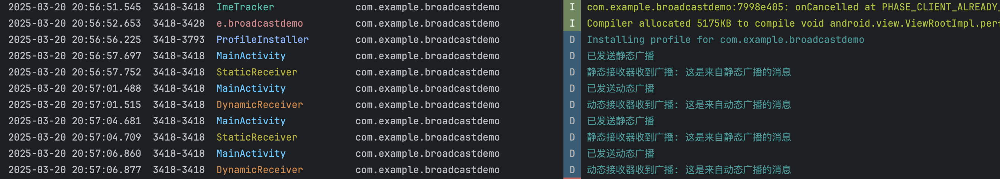

# **第四次作业**

#### **作业说明**

本次作业包含三个独立的小任务，具体要求如下：

### **作业1：广播接收器**
**要求**：

分别使用动态注册和静态注册广播，并接受广播日志。


### **作业2：AIDL 跨进程通信**
**要求**：

使用AIDL进行跨进程通信


### **作业3：联系人管理应用**
**要求**：

读取手机的联系人，以recyclerview的形式展现，动态添加联系人，完成刷新的操作。

---

#### **作业目录结构**

```markdown
Day04/  
├── README.md            # 本说明文档  
├── assets
│   ├── 任务1-Logcat广播消息输出-示意图.png
│   ├── 任务1-debug.apk             # 任务1构建输出的apk
│   ├── 任务1-演示视频.mov           # 任务1功能演示视频 
│   ├── 任务2-debug.apk             # 任务2构建输出的apk
│   ├── 任务2-演示视频.mov           # 任务2功能演示视频
│   ├── 任务3-debug.apk             # 任务3构建输出的apk
│   ├── 任务3-演示视频.mov           # 任务3功能演示视频 
│   └── 作业要求.png
└── daily_android_project
    ├── AIDLDemo              # Android Studio 项目源码-任务2
    │   ├── app
    │   ├── build
    │   ├── build.gradle
    │   └── ...
    ├── AddContactsDemo        # Android Studio 项目源码-任务3 
    │   ├── app
    │   ├── build
    │   ├── build.gradle
    │   └── ...
    └── BroadcastDemo           # Android Studio 项目源码-任务1 
        ├── app
        ├── build.gradle.kts
        ├── local.properties
        └── ...
```

---

### 作业一实现细节

#### 1. 静态广播接收器

静态广播接收器在应用安装时由系统注册，并在AndroidManifest.xml中声明。

- 实现了`StaticReceiver`类，继承自`BroadcastReceiver`
- 在AndroidManifest.xml中通过`<receiver>`标签注册
- 定义了接收的特定广播Action: `com.example.broadcastdemo.STATIC_ACTION`
- 设置`exported="false"`以确保只能由应用内部发送广播

```xml
<receiver
    android:name=".StaticReceiver"
    android:exported="false">
    <intent-filter>
        <action android:name="com.example.broadcastdemo.STATIC_ACTION" />
    </intent-filter>
</receiver>
```

#### 2. 动态广播接收器

动态广播接收器在代码中注册和注销，适用于生命周期有限的场景。

- 实现了`DynamicReceiver`类，继承自`BroadcastReceiver`
- 在`MainActivity`的`onCreate()`方法中注册：
  ```kotlin
  dynamicReceiver = DynamicReceiver()
  val filter = IntentFilter(DynamicReceiver.ACTION_DYNAMIC)
  registerReceiver(dynamicReceiver, filter, Context.RECEIVER_NOT_EXPORTED)
  ```
- 使用`Context.RECEIVER_NOT_EXPORTED`标志增强安全性
- 在`onDestroy()`方法中注销接收器，防止内存泄漏

#### 3. 广播发送

在用户界面中提供了两个按钮，分别用于发送静态和动态广播：

- 发送静态广播：
  ```kotlin
  val staticIntent = Intent(StaticReceiver.ACTION_STATIC).apply {
      putExtra("message", "这是来自静态广播的消息")
      setPackage(packageName)
  }
  sendBroadcast(staticIntent)
  ```

- 发送动态广播：
  ```kotlin
  val dynamicIntent = Intent(DynamicReceiver.ACTION_DYNAMIC).apply {
      putExtra("message", "这是来自动态广播的消息")
      setPackage(packageName)
  }
  sendBroadcast(dynamicIntent)
  ```

#### 4. 日志记录

所有广播相关操作都使用Android的Log系统记录：

- 广播接收器的注册和注销
- 广播的发送
- 广播接收器收到广播时的消息处理

通过Logcat可以观察整个广播发送和接收的过程，验证实现的正确性。

#### 5. UI实现

使用Jetpack Compose构建了简洁的用户界面，包含：
- 标题文本
- 两个功能按钮（发送静态广播和发送动态广播）
- 遵循Material3设计语言



---

### 作业二实现细节

#### 1. 配置 AIDL 支持

在 `build.gradle` 中启用 AIDL 支持，确保项目能正确编译 AIDL 文件。

#### 2. AIDL 接口设计

定义了一个简单的计算器接口，包含一个加法方法。通过 AIDL 文件定义的接口会由编译工具自动生成对应的 Java 文件。

#### 3. 服务端实现

计算器服务通过继承 Service 类并实现 AIDL 生成的 Stub 类来提供跨进程计算功能。服务在 `onBind()` 方法中返回实现了接口的 Binder 对象。

#### 4. 客户端使用

主活动中实现了以下关键步骤：
- 定义 ServiceConnection 处理服务连接和断开
- 使用 bindService() 方法绑定到计算器服务
- 通过 Stub.asInterface() 获取远程接口代理
- 通过代理对象调用远程方法并处理可能的异常
- 在销毁时正确解绑服务

#### 5. 数据交互流程

1. 用户在界面输入两个数字
2. 点击计算按钮触发远程调用
3. 请求通过 Binder 传递到服务进程
4. 服务进程执行计算并返回结果
5. 客户端接收结果并显示


---

### **作业三实现细节**

#### **联系人读取与展示功能**

1. **联系人读取**  
   - 使用`ContentResolver`成功读取手机联系人数据
   - 正确请求并处理`READ_CONTACTS`权限
   - 通过`ContactsContract`获取联系人姓名和电话号码

2. **列表展示**  
   - 使用`RecyclerView`实现联系人的列表展示
   - 自定义`ContactAdapter`适配器管理联系人数据展示
   - 联系人数据按姓名字母顺序排序显示

#### **动态刷新功能**

1. **自动刷新机制**  
   - 实现`ContentObserver`监听联系人数据变化
   - 监听多个URI确保捕获所有联系人变化
   - 在应用生命周期中正确管理观察者注册与注销

2. **手动刷新操作**  
   - 底部添加浮动刷新按钮(`FloatingActionButton`)
   - 点击按钮触发联系人数据重新加载
   - 刷新操作完成后显示Toast提示用户

#### **界面实现**

1. **联系人显示设计**  
   - 列表项布局包含姓名和电话号码两项信息
   - 采用垂直线性布局(`LinearLayoutManager`)展示联系人
   - 界面简洁清晰，信息展示完整

2. **交互优化**  
   - 权限处理友好，提供权限被拒绝时的用户提示
   - 刷新操作有明确的用户反馈
   - 确保空列表情况下的正确处理

---

### **提交信息**
**提交人**：Ryan  
**完成时间**：2025年3月20日  

---

