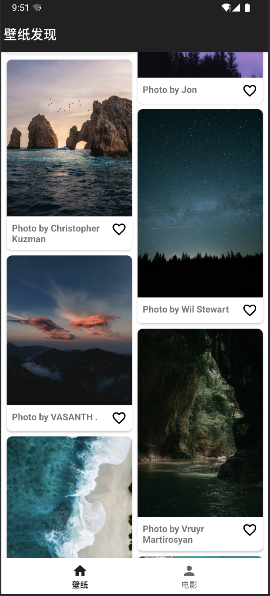

# **第六次作业：BRVAH和瀑布流**

## **作业说明**

#### 完成一个壁纸和电影浏览器

1. 实现一个ViewPager，由两个Fragment构成
2. Fragment1 使用 https://picsum.photos/300/400 数据源，能够实现下拉刷新与上滑加载更多，加载更多时需要停留1秒钟，让用户感知到加载条
3. Fragment2 使用 https://dbapi.ypsou.com/api/douban/movie/cast?id=26999852 数据，实现下拉刷新与上拉加载更多，上拉加载需要重新请求网络数据 实现无限循环

4. Fragment1与Fragment2 能够点击切换 / 滑动切换

---

#### **作业目录结构**

```markdown
Day06/  
├── README.md
├── assets
│   ├── 作业-debug.apk
│   ├── 作业要求.png
│   ├── 作业成果演示.mov
│   ├── 主界面展示截图.png
│   └── 图片详情页展示截图.png
└── daily_android_project
    └── brvahgallerydemo/
        ├── build.gradle
        ├── settings.gradle
        ├── src/
        │   ├── main/
        │   │   ├── AndroidManifest.xml
        │   │   ├── java/
        │   │   │   └── com/
        │   │   │       └── example/
        │   │   │           └── brvahgallerydemo/
        │   │   │               ├── adapter/
        │   │   │               │   ├── ContentAdapter.kt          # 适配器，用于显示壁纸内容
        │   │   │               │   ├── MovieAdapter.kt            # 适配器，用于显示电影内容
        │   │   │               │   └── MainPagerAdapter.kt        # 适配器，用于管理 ViewPager 中的 Fragment
        │   │   │               ├── model/
        │   │   │               │   ├── ContentItem.kt             # 数据模型，表示壁纸内容
        │   │   │               │   └── MovieItem.kt               # 数据模型，表示电影内容
        │   │   │               ├── viewmodel/
        │   │   │               │   ├── HomeViewModel.kt           # ViewModel，用于管理壁纸数据
        │   │   │               │   └── MovieViewModel.kt          # ViewModel，用于管理电影数据
        │   │   │               ├── DetailActivity.kt              # 详情页面，显示壁纸或电影的详细信息
        │   │   │               ├── MainActivity.kt                # 主活动，包含 ViewPager 和 TabLayout
        │   │   │               ├── WallpaperFragment.kt           # Fragment，用于显示壁纸内容
        │   │   │               └── MovieFragment.kt               # Fragment，用于显示电影内容
        │   │   ├── res/
        │   │   │   ├── layout/
        │   │   │   │   ├── activity_main.xml                      # 主活动的布局文件
        │   │   │   │   ├── fragment_wallpaper.xml                 # 壁纸 Fragment 的布局文件
        │   │   │   │   ├── fragment_movie.xml                     # 电影 Fragment 的布局文件
        │   │   │   │   ├── item_image.xml                         # 壁纸项的布局文件
        │   │   │   │   └── item_movie.xml                         # 电影项的布局文件
        │   │   │   ├── drawable/
        │   │   │   │   ├── ic_favorite_border.xml                 # 未收藏图标
        │   │   │   │   └── ic_favorite_filled.xml                 # 收藏图标
        │   │   │   ├── values/
        │   │   │   │   ├── strings.xml                            # 字符串资源
        │   │   │   │   └── styles.xml                             # 样式资源
        │   │   │   └── mipmap/
        │   │   │       └── ic_launcher.png                        # 应用图标
        │   └── test/
        │       └── java/
        │           └── com/
        │               └── example/
        │                   └── brvahgallerydemo/
        │                       └── ExampleUnitTest.kt             # 单元测试文件
```

---


## 实现细节

#### 1. ViewPager的实现

你已经实现了一个`ViewPager`，由两个`Fragment`构成，分别是`WallpaperFragment`和`MovieFragment`。`MainPagerAdapter`类负责管理这两个`Fragment`。

#### 2. Fragment1 (WallpaperFragment)

- **数据源**: 使用的是大型图片网站Unsplash的官方API接口，申请了个人用户的token。
- **下拉刷新**: 已经在`WallpaperFragment`中实现了`SwipeRefreshLayout`，调用`viewModel.refreshData()`来刷新数据。
- **上滑加载更多**: 需要在`RecyclerView`的滚动监听中实现加载更多功能，并在加载更多时停留1秒钟。

```kotlin
// 在WallpaperFragment中添加上滑加载更多功能
private fun setupRecyclerView() {
    adapter = ContentAdapter()
    binding.recyclerView.apply {
        layoutManager = StaggeredGridLayoutManager(2, StaggeredGridLayoutManager.VERTICAL)
        adapter = this@WallpaperFragment.adapter
        addOnScrollListener(object : RecyclerView.OnScrollListener() {
            override fun onScrolled(recyclerView: RecyclerView, dx: Int, dy: Int) {
                super.onScrolled(recyclerView, dx, dy)
                if (!recyclerView.canScrollVertically(1)) {
                    // 上滑加载更多
                    loadMoreData()
                }
            }
        })
    }
}

private fun loadMoreData() {
    binding.swipeRefreshLayout.isRefreshing = true
    Handler(Looper.getMainLooper()).postDelayed({
        viewModel.loadMoreData()
        binding.swipeRefreshLayout.isRefreshing = false
    }, 1000)
}
```




#### 3. Fragment2 (MovieFragment)

- **数据源**: 

  这里我没有使用电影简介API`https://dbapi.ypsou.com/api/douban/movie/cast?id=26999852`，而是想尝试将豆瓣Top250电影榜单给展现出来，据官方文档，API为`https://dbapi.ypsou.com/api/douban/list?listname=top250&start=1`，但在实际请求过程中我发现该API并不可用，鉴于时间限制就暂时没能展现出内容，但是相关请求的解析和展示功能的代码均已实现。

- **下拉刷新**: 实现`SwipeRefreshLayout`，调用`viewModel.refreshData()`来刷新数据。

```kotlin
class MovieFragment : Fragment() {
    private var _binding: FragmentMovieBinding? = null
    private val binding get() = _binding!!
    private val viewModel: MovieViewModel by viewModels()
    private lateinit var adapter: MovieAdapter

    override fun onCreateView(
        inflater: LayoutInflater,
        container: ViewGroup?,
        savedInstanceState: Bundle?
    ): View {
        _binding = FragmentMovieBinding.inflate(inflater, container, false)
        return binding.root
    }

    override fun onViewCreated(view: View, savedInstanceState: Bundle?) {
        super.onViewCreated(view, savedInstanceState)
        setupRecyclerView()
        setupSwipeRefresh()
        observeData()
    }

    private fun setupRecyclerView() {
        adapter = MovieAdapter()
        binding.recyclerView.apply {
            layoutManager = LinearLayoutManager(context)
            adapter = this@MovieFragment.adapter
            addOnScrollListener(object : RecyclerView.OnScrollListener() {
                override fun onScrolled(recyclerView: RecyclerView, dx: Int, dy: Int) {
                    super.onScrolled(recyclerView, dx, dy)
                    if (!recyclerView.canScrollVertically(1)) {
                        // 上拉加载更多
                        loadMoreData()
                    }
                }
            })
        }
    }

    private fun setupSwipeRefresh() {
        binding.swipeRefreshLayout.setOnRefreshListener {
            viewModel.refreshData()
        }
    }

    private fun loadMoreData() {
        binding.swipeRefreshLayout.isRefreshing = true
        viewModel.loadMoreData()
        binding.swipeRefreshLayout.isRefreshing = false
    }

    private fun observeData() {
        viewModel.movieItems.observe(viewLifecycleOwner) { items ->
            adapter.setList(items)
            binding.swipeRefreshLayout.isRefreshing = false
        }
    }

    override fun onDestroyView() {
        super.onDestroyView()
        _binding = null
    }
}
```

#### 4. Fragment切换

实现了`ViewPager`，可以通过点击和滑动来切换`Fragment`。在布局文件中配置了`ViewPager`和`TabLayout`，并将它们关联起来。

```xml
<!-- 在布局文件中添加ViewPager和TabLayout -->
<com.google.android.material.tabs.TabLayout
    android:id="@+id/tabLayout"
    android:layout_width="match_parent"
    android:layout_height="wrap_content"/>

<androidx.viewpager2.widget.ViewPager2
    android:id="@+id/viewPager"
    android:layout_width="match_parent"
    android:layout_height="match_parent"/>
```

```kotlin
// 在Activity中设置ViewPager和TabLayout
class MainActivity : AppCompatActivity() {
    override fun onCreate(savedInstanceState: Bundle?) {
        super.onCreate(savedInstanceState)
        setContentView(R.layout.activity_main)

        val viewPager: ViewPager2 = findViewById(R.id.viewPager)
        val tabLayout: TabLayout = findViewById(R.id.tabLayout)

        viewPager.adapter = MainPagerAdapter(this)
        TabLayoutMediator(tabLayout, viewPager) { tab, position ->
            tab.text = when (position) {
                0 -> "Wallpapers"
                1 -> "Movies"
                else -> null
            }
        }.attach()
    }
}
```

---

### **提交信息**
**提交人**：易率  
**完成时间**：2025年3月22日  

---

