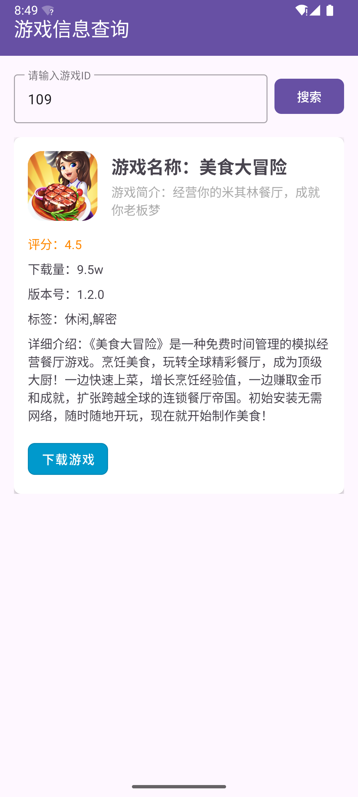

# **第九次作业：代码规范与异常处理**

## **作业说明**

**作业1**
单例的几种实现方式

**作业2**
模拟crash，使用主线程setDefaultUncaughtExceptionHandler的方法拦截crash异常，弹窗Toast提示，并且不影响系统crash事件传递

**作业3**
采用MVVM架构，实现输入游戏ID，通过网络请求，获取游戏信息，通过Databinding方式显示到UI界面，需要使用到LiveData。接口链接为：https://hotfix-service-prod.g.mi.com/quick-game/game/109

**整体要求**
代码规范采用驼峰命名规范，有用到设计模式

---

#### **作业目录结构**

```markdown
Day09/  
├── README.md
├── assets
│   ├── Crash测试-debug.apk
│   ├── Crash原因输出.png
│   ├── Crash测试演示视频.mov
│   ├── 单例测试-debug.apk
│   ├── 作业要求.png
│   ├── 游戏信息获取-debug.apk
│   ├── 单例测试结果.png
│   ├── 游戏信息获取APP演示.mov
│   ├── 游戏信息获取APP截图1.png
│   └── 游戏信息获取APP截图2.png
└── daily_android_project
    ├── CrashDemo       #Crash模拟项目文件
    ├── Day09Demo       #单例实现项目文件
    └── GameInfoQueryDemo/
        ├── app/
        │   ├── build.gradle.kts
        │   ├── proguard-rules.pro  
        │   ├── src/
        │   │   ├── main/
        │   │   │   ├── AndroidManifest.xml  # Android清单文件
        │   │   │   ├── java/
        │   │   │   │   └── com/
        │   │   │   │       └── example/
        │   │   │   │           └── gameinfoquerydemo/
        │   │   │   │               ├── MainActivity.kt  # 主活动文件
        │   │   │   │               ├── api/
        │   │   │   │               │   └── GameApi.kt  # 游戏信息数据API
        │   │   │   │               ├── model/
        │   │   │   │               │   └── GameInfo.kt  # 游戏信息数据模型
        │   │   │   │               ├── repository/
        │   │   │   │               │   └── GameRepository.kt  # 数据操作仓库
        │   │   │   │               └── viewmodel/
        │   │   │   │                   └── GameViewModel.kt  # 管理UI相关数据的ViewModel
        │   │   │   ├── res/
        │   │   │   │   ├── layout/
        │   │   │   │   │   └── activity_main.xml  # 主活动的布局文件
        │   │   │   │   ├── drawable/
        │   │   │   │   │   └── ic_launcher_foreground.xml  # 应用图标前景
        │   │   │   │   ├── values/
        │   │   │   │   │   └── strings.xml  # 字符串资源
        │   │   │   │   └── ...  # 其他资源文件
        │   │   │   └── ...  # 其他源集（例如测试）
        │   └── ...
        ├── build.gradle.kts  
        └── settings.gradle.kts 
```

---

## 实现细节

### 任务一

我创建了一个名为 singleton 的包，其中不同文件实现了文件名称对应的几种常见的单例模式实现方式，包括饿汉式、懒汉式、双重检查锁、静态内部类和枚举。每种实现方式具体的代码逻辑、特点和适用场景如下：

#### 饿汉式单例 (Hungry Singleton)
饿汉式单例在类加载时就创建实例，线程安全，但可能会造成不必要的内存浪费。

```java
public class HungrySingleton {
    private static final HungrySingleton instance = new HungrySingleton();
    
    private HungrySingleton() {}
    
    public static HungrySingleton getInstance() {
        return instance;
    }
}
```

#### 懒汉式单例 (Lazy Singleton)
懒汉式单例在第一次使用时才创建实例，节省内存，但线程不安全。

```java
public class LazySingleton {
    private static LazySingleton instance;
    
    private LazySingleton() {}
    
    public static LazySingleton getInstance() {
        if (instance == null) {
            instance = new LazySingleton();
        }
        return instance;
    }
}
```

#### 双重检查锁单例 (Double-Checked Locking Singleton)
双重检查锁单例在第一次使用时才创建实例，线程安全且高效。

```java
public class DoubleCheckedLockingSingleton {
    private static volatile DoubleCheckedLockingSingleton instance;
    
    private DoubleCheckedLockingSingleton() {}
    
    public static DoubleCheckedLockingSingleton getInstance() {
        if (instance == null) {
            synchronized (DoubleCheckedLockingSingleton.class) {
                if (instance == null) {
                    instance = new DoubleCheckedLockingSingleton();
                }
            }
        }
        return instance;
    }
}
```

#### 静态内部类单例 (Static Inner Class Singleton)
静态内部类单例利用JVM类加载机制保证线程安全，延迟加载。

```java
public class StaticInnerSingleton {
    private StaticInnerSingleton() {}

    private static class SingletonHolder {
        private static final StaticInnerSingleton INSTANCE = new StaticInnerSingleton();
    }

    public static StaticInnerSingleton getInstance() {
        return SingletonHolder.INSTANCE;
    }
}
```

#### 枚举单例 (Enum Singleton)
枚举单例实现简单，线程安全，防止反序列化创建新对象。

```java
public enum EnumSingleton {
    INSTANCE;
    
    public void someMethod() {
        // 方法实现
    }
}
```

此外，我还创建了一个 Android Activity 来测试这些单例模式，并将该Activity 设置为应用程序的启动 Activity。界面上会显示所有单例模式的测试结果。如果每个测试结果都显示 true，则表明每种实现方式都成功保证了单例性。

测试结果如下：


### 任务二

我实现了模拟程序崩溃，并使用 `setDefaultUncaughtExceptionHandler` 方法拦截异常进行处理。当程序崩溃时，弹出 Toast 提示用户，同时不影响系统默认的崩溃事件传递。

1. **创建自定义的 `UncaughtExceptionHandler` 类**：
   - 该类实现 `Thread.UncaughtExceptionHandler` 接口。
   - 在 `uncaughtException` 方法中处理异常，弹出 Toast 提示用户，并调用系统默认的异常处理器。

```kotlin
package com.example.crashdemo

import android.content.Context
import android.os.Looper
import android.widget.Toast

class CustomExceptionHandler(
    private val context: Context,
    private val defaultHandler: Thread.UncaughtExceptionHandler?
) : Thread.UncaughtExceptionHandler {

    override fun uncaughtException(thread: Thread, throwable: Throwable) {
        // 在主线程中显示 Toast
        Looper.prepare()
        Toast.makeText(context, "程序崩溃了，请稍后重试", Toast.LENGTH_LONG).show()
        Looper.loop()

        // 调用系统默认的异常处理器
        defaultHandler?.uncaughtException(thread, throwable)
    }
}
```

2. **在 `MainActivity` 中设置默认的 `UncaughtExceptionHandler`**：
   - 在 `onCreate` 方法中设置自定义的 `UncaughtExceptionHandler`。

```kotlin
package com.example.crashdemo

import android.os.Bundle
import android.widget.Button
import androidx.activity.enableEdgeToEdge
import androidx.appcompat.app.AppCompatActivity
import androidx.core.view.ViewCompat
import androidx.core.view.WindowInsetsCompat

class MainActivity : AppCompatActivity() {
    override fun onCreate(savedInstanceState: Bundle?) {
        super.onCreate(savedInstanceState)
        enableEdgeToEdge()
        setContentView(R.layout.activity_main)

        // 设置自定义的 UncaughtExceptionHandler
        val defaultHandler = Thread.getDefaultUncaughtExceptionHandler()
        Thread.setDefaultUncaughtExceptionHandler(CustomExceptionHandler(this, defaultHandler))

        // 设置按钮点击事件
        findViewById<Button>(R.id.crashButton).setOnClickListener {
            // 触发空指针异常
            val nullString: String? = null
            nullString!!.length
        }

        ViewCompat.setOnApplyWindowInsetsListener(findViewById(R.id.main)) { v, insets ->
            val systemBars = insets.getInsets(WindowInsetsCompat.Type.systemBars())
            v.setPadding(systemBars.left, systemBars.top, systemBars.right, systemBars.bottom)
            insets
        }
    }
}
```

3. **模拟崩溃**：
   - 在按钮点击事件中触发空指针异常，模拟程序崩溃。


4. **遵循的设计模式规范**
   - 在本次实现中，使用了单例模式来确保 `CustomExceptionHandler` 只有一个实例，并且在整个应用程序生命周期中保持一致。
   

### 任务三

#### 1. 项目结构
项目采用MVVM架构，主要包含以下几个部分：
- `Activity`: MainActivity.kt
- `ViewModel`: GameViewModel.kt
- `Repository`: GameRepository.kt
- `Data Model`: GameInfo.kt
- `Layout`: activity_main.xml
- `DataBinding`: ActivityMainBinding


#### 2. 数据模型（Model）
Model层负责数据的获取和处理。在你的项目中，GameRepository类负责通过网络请求获取游戏信息。  
#### 3. View
View层负责UI的展示。在你的项目中，MainActivity和activity_main.xml文件构成了视图层。MainActivity通过DataBinding将UI组件与ViewModel绑定。  
#### 4. ViewModel
ViewModel层负责数据和UI的交互。在你的项目中，GameViewModel类负责管理游戏信息的LiveData对象，并处理从Model层获取数据的逻辑。

#### 5. 数据绑定（DataBinding）
在`MainActivity`中使用`ActivityMainBinding`进行数据绑定。通过`ViewModel`中的`LiveData`来观察数据变化，并自动更新UI。

#### 6. LiveData
使用`LiveData`来管理数据状态，包括游戏信息、加载状态和错误信息。`LiveData`的变化会自动通知观察者（即UI），从而更新界面。

#### 7. 网络请求接口（Repository）
通过`Retrofit`库进行网络请求，获取游戏信息。接口地址为：https://hotfix-service-prod.g.mi.com/quick-game/109。请求成功后，将数据传递给`ViewModel`，并通过`LiveData`更新UI。

#### 8. 设计模式
- **单例模式**：在`Retrofit`实例的创建中使用单例模式，确保全局只有一个网络请求实例。
- **观察者模式**：`LiveData`和`ViewModel`的结合使用，实现了观察者模式，`LiveData`的变化会通知观察者（UI）。

#### 9. 代码实现步骤
1. **创建Model类**：定义游戏信息的数据模型类。
2. **创建ViewModel类**：在`ViewModel`中定义`LiveData`对象，用于存储和管理游戏信息、加载状态和错误信息。实现获取游戏信息的逻辑。
3. **创建网络请求接口**：使用`Retrofit`定义网络请求接口，获取游戏信息。
4. **在Activity中设置数据绑定**：在`MainActivity`中初始化`ViewModel`和`DataBinding`，设置观察者监听`LiveData`的变化，更新UI。
5. **实现UI交互**：在`MainActivity`中实现用户输入游戏ID并点击查询按钮的逻辑，调用`ViewModel`中的方法获取游戏信息。

#### 10. 代码规范
- 采用驼峰命名规范，例如：`getGameInfo`。
- 代码清晰、规范，符合最佳实践。

#### 11. 运行效果
用户在界面输入游戏ID后，点击查询按钮，通过网络请求获取游戏信息，并将信息展示在UI界面上。如果请求失败，显示错误信息。




---

### **提交信息**

**提交人**：Ryan  
**完成时间**：2025年3月25日  

---

