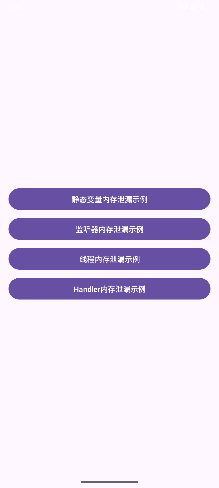
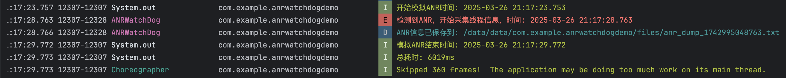

# **第十次作业：内存泄漏与ANR**

## **作业说明**

**任务一**

1. 完成以下4种类型的内存泄露场景，并将原因和解法通过注释标注出来：
   1.1 静态变量/单例引用导致的内存泄露
   1.2 注册和监听未正确释放导致的内存泄露
   1.3 内部线程持有外包类导致内容泄漏
   1.4 Handler引起的内存泄露

**任务二**

2. 分别在以下方法中引发ANR，并通过Log打印引发ANR大致的时间：
   - Activity的`onCreate`
   - Service的`onStartCommand`
   - BroadcastReceiver的`onReceive`

**任务三**

1. 优化ANR-WatchDog检测ANR机制：
   - 将原来的5秒发送一次改为1秒发送一次。
   - 若连续发送5次且均未收到回包，则判定为ANR现象，随后采集线程信息。

---

#### **作业目录结构**

```markdown
Day10/  
├── README.md
├── assets
│   ├── ANR-debug.apk
│   ├── ANRWatchdog-debug.apk
│   ├── ANRWatchdog演示视频.mov
│   ├── ANRWatchdog日志截图.png
│   ├── ANR模拟触发视频.mov
│   ├── ActivityANR时间.png
│   ├── BroadcastANR时间.png
│   ├── MemoryLeak-debug.apk
│   ├── ServiceANR时间.png
│   ├── anr_dump_1742995048763.txt     #线程信息采集输出的文件
│   ├── 模拟ANR测试界面.png
│   ├── 使用Profiler检测内存泄漏截图.png
│   ├── 作业要求.jpg
│   ├── 内存泄漏触发检查视频.mov
│   └── 内存泄漏测试界面截图.png
└── daily_android_project
    ├── ANRDemo             #任务二项目目录
    ├── ANRWatchdogDemo     #任务三项目目录
    └── MemoryLeakDemo      #任务一项目目录
```

---

## 实现细节

### 任务一

#### 1.1 静态变量/单例引用导致的内存泄露

**原因**: 静态变量持有Activity的引用，导致Activity无法被GC回收。

**解法**: 使用`WeakReference`来持有Activity的引用，这样当Activity被销毁时，引用会自动被清除。

```kotlin
// 错误示例：静态变量持有Activity引用
private var staticActivity: MainActivity? = null

// 正确示例：使用WeakReference
// private var staticActivity: WeakReference<MainActivity>? = null
```

```kotlin
// 在onCreate中
staticActivity = this

// 正确示例：使用WeakReference
// staticActivity = WeakReference(this)
```

```kotlin
// 在onDestroy中
staticActivity = null
```

#### 1.2 注册和监听未正确释放导致的内存泄露

**原因**: LeakyListener类持有Activity的引用，且监听器未在`onDestroy`中移除，导致Activity无法被GC回收。

**解法**: 在`onDestroy`中调用`stopListening()`并置空引用。

```kotlin
// 错误示例：未在onDestroy中移除监听器
leakyListener = LeakyListener(this)
leakyListener?.startListening()
```

```kotlin
// 在onDestroy中
leakyListener?.stopListening()
leakyListener = null
```

#### 1.3 内部线程持有外部类导致的内存泄露

**原因**: 匿名内部类Thread持有外部类的引用，导致Activity无法被GC回收。

**解法**: 使用静态内部类，在线程中避免持有Activity引用，或在`onDestroy`中中断线程。

```kotlin
// 错误示例：内部类持有外部类引用
leakyThread = Thread {
    while (true) {
        // 模拟耗时操作
        Thread.sleep(1000)
    }
}
leakyThread?.start()
```

```kotlin
// 在onDestroy中
leakyThread?.interrupt()
leakyThread = null
```

#### 1.4 Handler引起的内存泄露

**原因**: Handler持有Activity的引用，且Runnable作为内部类也持有Activity引用，导致Activity无法被GC回收。

**解法**: 使用静态内部类，在`onDestroy`中移除Handler的回调，或使用WeakReference持有Activity引用。

```kotlin
// 错误示例：Handler持有Activity引用
leakyHandler = Handler(Looper.getMainLooper())
leakyHandler?.postDelayed(leakyRunnable, 10000)
```

```kotlin
// 在onDestroy中
leakyHandler?.removeCallbacks(leakyRunnable)
leakyHandler = null
```

同时我还编写的图形界面来测试每种内存泄漏的情况，使用不同按钮来触发不同的内存泄漏场景，如下图：



### 任务二

在这个任务中我发现单纯的`Thread.sleep`虽然会阻塞主线程，但它不会消耗CPU资源，只会让线程进入休眠状态，而无法正常触发ANR检测。而在实际应用中，ANR通常是由于主线程被长时间的计算或I/O操作阻塞，导致无法及时处理用户输入或其他事件。

于是我将阻塞逻辑更改为在主线程中执行大量计算和`Thread.sleep`的组合，从而更真实地模拟ANR的场景：

1. **大量计算**：消耗CPU资源，模拟复杂的计算任务。
2. **`Thread.sleep`**：模拟I/O操作或其他需要等待的任务。

这样可以更全面地模拟实际应用中可能导致ANR的情况。

#### 1. 在Activity的`onCreate`方法中引发ANR

在`MainActivity`的`onCreate`方法中，添加耗时操作并通过`Log`打印引发ANR的大致时间。

```kotlin
override fun onCreate(savedInstanceState: Bundle?) {
    super.onCreate(savedInstanceState)
    enableEdgeToEdge()
    setContentView(R.layout.activity_main)

    // 打印开始时间
    val startTime = System.currentTimeMillis()
    val startTimeStr = dateFormat.format(Date(startTime))
    Log.d(TAG, "Activity ANR 开始时间: $startTimeStr")

    // 在主线程中执行耗时操作
    try {
        // 执行大量计算
        var result = 0
        for (i in 0..100000000) {
            result += i
        }

        // 模拟 IO 操作
        Thread.sleep(10000)

        // 再次执行大量计算
        for (i in 0..100000000) {
            result += i
        }

        // 再次模拟 IO 操作
        Thread.sleep(10000)

        Log.d(TAG, "Activity ANR 计算结果: $result")
    } catch (e: Exception) {
        Log.e(TAG, "Activity ANR 模拟过程中发生错误", e)
    }

    // 打印结束时间
    val endTime = System.currentTimeMillis()
    val endTimeStr = dateFormat.format(Date(endTime))
    val duration = endTime - startTime
    Log.d(TAG, "Activity ANR 结束时间: $endTimeStr, 总耗时: ${duration}ms")
}
```

#### 2. 在Service的`onStartCommand`方法中引发ANR

在`ANRService`的`onStartCommand`方法中，添加耗时操作并通过`Log`打印引发ANR的大致时间。

```kotlin
override fun onStartCommand(intent: Intent?, flags: Int, startId: Int): Int {
    val startTime = System.currentTimeMillis()
    val startTimeStr = dateFormat.format(Date(startTime))
    Log.d(TAG, "Service ANR 开始时间: $startTimeStr")

    // 在主线程中执行耗时操作
    try {
        // 执行大量计算
        var result = 0
        for (i in 0..100000000) {
            result += i
        }

        // 模拟 IO 操作
        Thread.sleep(10000)

        // 再次执行大量计算
        for (i in 0..100000000) {
            result += i
        }

        // 再次模拟 IO 操作
        Thread.sleep(10000)

        Log.d(TAG, "Service ANR 计算结果: $result")
    } catch (e: Exception) {
        Log.e(TAG, "Service ANR 模拟过程中发生错误", e)
    }

    val endTime = System.currentTimeMillis()
    val endTimeStr = dateFormat.format(Date(endTime))
    val duration = endTime - startTime
    Log.d(TAG, "Service ANR 结束时间: $endTimeStr, 总耗时: ${duration}ms")
    return START_NOT_STICKY
}
```

#### 3. 在BroadcastReceiver的`onReceive`方法中引发ANR

在`ANRReceiver`的`onReceive`方法中，添加耗时操作并通过`Log`打印引发ANR的大致时间。

```kotlin
override fun onReceive(context: Context?, intent: Intent?) {
    val startTime = System.currentTimeMillis()
    val startTimeStr = dateFormat.format(Date(startTime))
    Log.d(TAG, "BroadcastReceiver ANR 开始时间: $startTimeStr")

    // 在主线程中执行耗时操作
    try {
        // 执行大量计算
        var result = 0
        for (i in 0..100000000) {
            result += i
        }

        // 模拟 IO 操作
        Thread.sleep(10000)

        // 再次执行大量计算
        for (i in 0..100000000) {
            result += i
        }

        // 再次模拟 IO 操作
        Thread.sleep(10000)

        Log.d(TAG, "BroadcastReceiver ANR 计算结果: $result")
    } catch (e: Exception) {
        Log.e(TAG, "BroadcastReceiver ANR 模拟过程中发生错误", e)
    }

    val endTime = System.currentTimeMillis()
    val endTimeStr = dateFormat.format(Date(endTime))
    val duration = endTime - startTime
    Log.d(TAG, "BroadcastReceiver ANR 结束时间: $endTimeStr, 总耗时: ${duration}ms")
}
```

用于测试的图形界面：


ANR触发时间Log截图：


Activity约在6s后发生ANR


Service约在6s后发生ANR


BroadcastReceiver约在6s后发生ANR

### 任务三

在此任务中使用自定义的ANRWatchdog优化ANR检测机制，这里沿用了之前任务二Activity触发ANR的逻辑并使用ANRWatchdog检测，主界面点击按钮即触发主线程阻塞，ANRWatchdog会采集线程信息并输出到txt文件中。

#### ANRWatchDog 类

1. **心跳机制**：
   - 修改 `heartbeatRunnable`，使其每秒发送一次心跳信号。
   - 使用 `mainHandler.postDelayed(this, 1000)` 实现每秒发送一次心跳。

2. **ANR 检测**：
   - 在 `checkThread` 中，每秒检查一次主线程响应时间。
   - 如果连续 5 次未收到响应（即 5 秒内未收到心跳信号），则判定为 ANR 现象。

3. **线程信息采集**：
   - 在 `handleANR` 方法中，获取所有线程的堆栈信息并保存到文件中。

#### 大致代码结构

##### ANRWatchDog.kt

- 定义 `mainHandler` 和 `checkHandler`。
- 初始化 `lastResponseTime` 和 `noResponseCount`。
- 创建 `checkThread` 以监控主线程响应时间。
- 实现 `heartbeatRunnable` 以每秒更新 `lastResponseTime`。
- 实现 `start` 和 `stop` 方法以控制 ANRWatchDog。
- 实现 `handleANR` 以在检测到 ANR 时收集并保存线程信息。

##### MainActivity.kt

- 在 `onCreate` 中初始化并启动 `ANRWatchDog`。
- 设置一个按钮，通过阻塞主线程 6 秒来模拟 ANR。
- 在 `onDestroy` 中停止 `ANRWatchDog`。

#### 优化后效果截图



---

### **提交信息**

**提交人**：Ryan  

**完成时间**：2025年3月26日  

---

