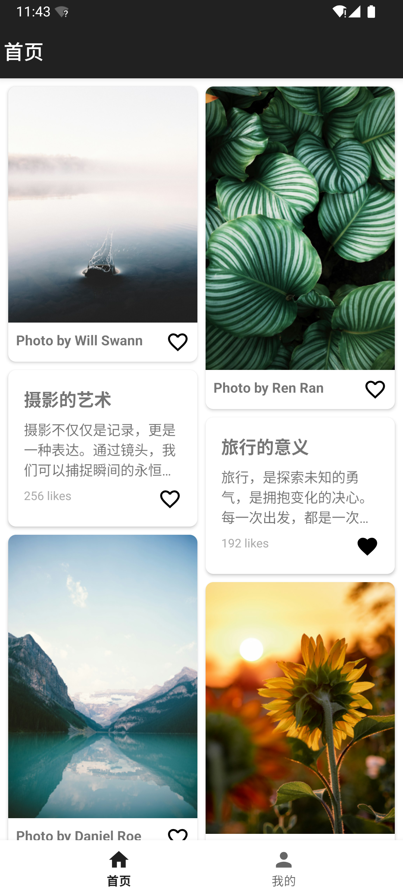
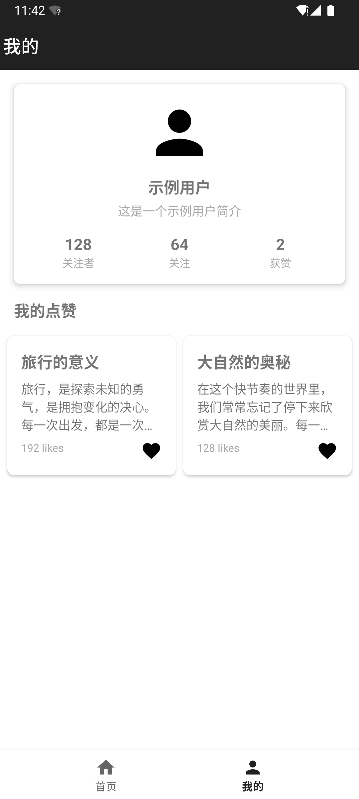
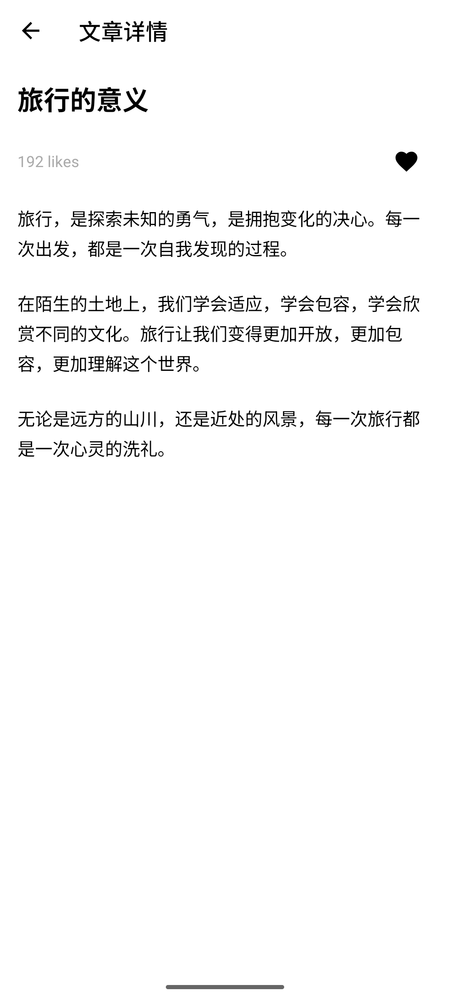
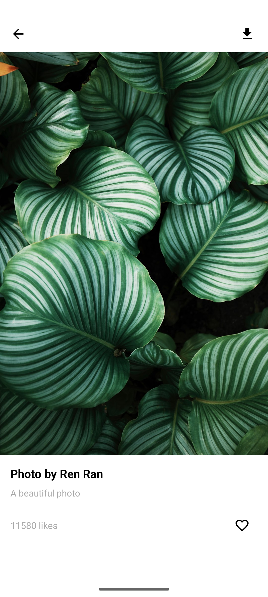

# **第十一次作业：Kotlin基础**

## **作业说明**

使用 Kotlin 实现滑动列表，支持点击查看详情大图与文案，包含下拉刷新功能。

**要求：**

1. 两个页面：「首页」与「我的」页面。点击底部按钮（首页、我的）进行页面切换。

2. 「首页」使用`RecyclerView`和`BaseRecyclerViewAdapterHelper`实现一个列表，列表有两种类型，分别是文本类型和图片类型。
   - 两种类型均有点赞状态：已点赞、未点赞。
   - 图片使用网络图片，`Glide` 加载。

3. 「首页」使用 `SwipeRefreshLayout` 实现下拉刷新和上拉加载，数据自行模拟。（可选）

4. 「详情页」区分文本详情页和图片详情页：

   - 点击「首页」文本类型的列表项则展示文本详情页，否则为图片详情页。
   - 两种详情页均可以点赞和取消点赞，操作后的状态需同步到首页。

---

## **作业目录结构**

```markdown
Day11/  
├── README.md
├── assets
│   ├── APP功能演示视频.mov     #主要功能完成度演示
│   ├── 作业-debug.apk
│   ├── 作业要求.png
│   ├── 我的页截图.png
│   ├── 主页列表截图.png
│   ├── 图片详情页截图.png
│   └── 文字详情页截图.png
└── daily_android_project
    └── BRVAHGalleryDemo
    ├── app/
    │   ├── build.gradle.kts
    │   ├── src/
    │   │   ├── main/
    │   │   │   ├── AndroidManifest.xml  # 应用程序的清单文件，声明权限和活动
    │   │   │   ├── java/
    │   │   │   │   └── com/
    │   │   │   │       └── example/
    │   │   │   │           └── brvahgallerydemo/
    │   │   │   │               ├── MainActivity.kt  # 主活动，包含页面切换逻辑
    │   │   │   │               ├── UserFragment.kt  # 我的页面，显示用户信息和收藏内容
    │   │   │   │               ├── HomeFragment.kt  # 首页，包含内容列表和刷新逻辑
    │   │   │   │               ├── adapter/
    │   │   │   │               │   ├── ContentAdapter.kt  # 适配器类，处理不同类型的列表项
    │   │   │   │               │   └── MainPagerAdapter.kt  # 主页面适配器
    │   │   │   │               ├── data/
    │   │   │   │               │   └── FavoriteManager.kt  # 管理点赞状态
    │   │   │   │               ├── model/
    │   │   │   │               │   └── ContentItem.kt  # 数据模型类，包含ImageItem和TextItem
    │   │   │   │               ├── viewmodel/
    │   │   │   │               │   └── HomeViewModel.kt  # ViewModel类，管理首页数据
    │   │   │   │               ├── DetailActivity.kt  # 图片详情页
    │   │   │   │               └── TextDetailActivity.kt  # 文本详情页
    │   │   │   ├── res/
    │   │   │   │   ├── drawable/
    │   │   │   │   │   └── ic_download.xml  # 下载图标
    │   │   │   │   ├── layout/
    │   │   │   │   │   ├── activity_main.xml  # 主活动布局
    │   │   │   │   │   ├── fragment_home.xml  # 首页布局
    │   │   │   │   │   ├── fragment_user.xml  # 我的页面布局
    │   │   │   │   │   ├── activity_detail.xml  # 图片详情页布局
    │   │   │   │   │   └── activity_text_detail.xml  # 文本详情页布局
    │   │   │   │   ├── mipmap/
    │   │   │   │   ├── values/
    │   │   │   │   └── ...
    │   │   └── ...
    │   └── ...
    ├── build.gradle.kts
    └── settings.gradle.kts
```

---

## 实现细节

> 这次作业是在Day06的BRVAH瀑布流作业基础上进一步完善和优化，在达到作业要求之外还额外添加了一些实用功能（如实现**下拉加载**，我的页面增加**用户资料占位块**，实现**收藏夹**展示我点赞过的图片和文字的功能，图片详情页添加**图片下载功能**），以强化练习Kotlin语言的特性和用法。

### 1. 页面结构

项目包含两个主要页面：「首页」和「我的」页面。通过底部导航栏按钮进行页面切换。

- **MainActivity**：主活动，包含`ViewPager2`和`BottomNavigationView`，用于页面切换。
- **UserFragment**：我的页面，显示用户信息和收藏内容。
- **HomeFragment**：首页，显示内容列表。

### 2. 首页实现

**RecyclerView**和**BaseRecyclerViewAdapterHelper**用于实现首页的内容列表，列表项分为文本类型和图片类型。

- **ContentAdapter**：适配器类，继承自`BaseQuickAdapter`，用于处理不同类型的列表项。
- **ContentItem**：数据模型类，包含`ImageItem`和`TextItem`两种类型。
- **Glide**：用于加载网络图片。

**点赞功能**：每个列表项都有点赞状态，通过`FavoriteManager`管理点赞状态。





### 3. 下拉刷新和上拉加载

**SwipeRefreshLayout**用于实现下拉刷新功能。

- **SwipeRefreshLayout**：包裹`RecyclerView`，实现下拉刷新。
- **上拉加载**：通过监听`RecyclerView`的滚动事件实现。

### 4. 详情页

根据列表项类型区分文本详情页和图片详情页。

- **TextDetailActivity**：文本详情页，显示文本内容。

  

- **DetailActivity**：图片详情页，显示大图。

  

**点赞同步**：在详情页进行点赞操作后，状态同步到首页。

### 代码结构

- `MainActivity.kt`：主活动，包含页面切换逻辑。
- `HomeFragment.kt`：首页，包含内容列表和刷新逻辑。
- `UserFragment.kt`：我的页面，显示用户信息和收藏内容。
- `ContentAdapter.kt`：适配器类，处理不同类型的列表项。
- `ContentItem.kt`：数据模型类，包含`ImageItem`和`TextItem`。
- `FavoriteManager.kt`：管理点赞状态。
- `TextDetailActivity.kt`：文本详情页。
- `DetailActivity.kt`：图片详情页。

### 依赖库

- `BaseRecyclerViewAdapterHelper`：用于简化`RecyclerView`适配器的实现。
- `Glide`：用于加载网络图片。
- `SwipeRefreshLayout`：用于实现下拉刷新功能。

---

### **提交信息**

**提交人**：易率  

**完成时间**：2025年3月27日  

---

